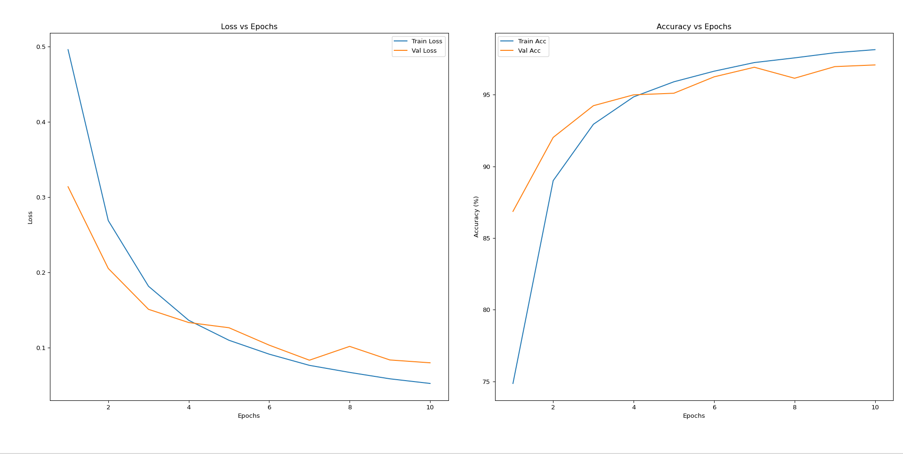

<div>

<div align="center">
    
    <p>Real pics or AI tricks? We’ve got your back before you click!</p>
</div>
</div>

<div align="center">
  


</div>

## Overview

UnFake is the first platform to integrate a deepfake detection tool directly into the image-downloading process. UnFake focuses on building a deepfake image classification system for mainly face and (noise:body and whatever images came during scraping below types of images) images from Unsplash, a platform with billions of images. The goal is to determine whether an image is a deepfake or real on Unsplash website, addressing the growing concern of manipulated media on such platforms. Billions of images flood platforms like Unsplash and Adobe Stock, yet none guarantee whether they’re real or AI-generated deepfakes. This lack of transparency leaves users vulnerable to misinformation, legal liabilities (e.g., copyright or defamation issues), and reputational damage.

Unsplash, a prominent platform for free, high-quality images, has become a critical resource for a diverse user base, including marketers, designers, and educators. However, the rise of deepfake technology, leveraging advanced artificial intelligence and deep learning, poses significant challenges to the authenticity of digital media on such platforms. UnFake focuses on building a deepfake image classification system for Unsplash, particularly for face and body images, and examines the implications for users and the legal system.

Unsplash, as described on its official website [Unsplash](https://unsplash.com/), hosts over 5 million photos and generates more than 13 billion photo impressions monthly, according to its Wikipedia entry [Unsplash - Wikipedia](https://en.wikipedia.org/wiki/Unsplash). It is a go-to resource for users seeking royalty-free images for various purposes, from creative projects to marketing campaigns. The platform's popularity, with over 330,000 contributing photographers, underscores its importance in digital media ecosystems. But Deepfake tech has blurred the lines between reality and fabrication, making it increasingly difficult to distinguish real images from manipulated ones.

## Why UnFake Exists?: Reason to build this
Unsplash, a platform hosting billions of images, faces the challenge of deepfake images, particularly those involving human faces and bodies. These AI-manipulated images pose a significant threat to the authenticity of digital media, impacting users who rely on Unsplash for creative and professional needs. The problem is to develop a deepfake image classification system that can accurately identify whether an image is real or a deepfake, thereby protecting users from potential harms such as misinformation, reputation damage, and legal liabilities.

### Main Page

<div align="center">
	

</div>

### Demo (Click on image to watch video):

<div align="center">
  <a href="https://drive.google.com/file/d/1Du6u_1jxerVEeP3ZST4kDoONDGW7i9di/view?usp=sharing">
    
</div>

## Users of Unsplash and Similar Sites
These users rely on Unsplash for its accessibility and quality, making the presence of deepfake images a significant concern. For instance, marketers using deepfake images in campaigns could face legal repercussions for misleading advertising, while educators might inadvertently use manipulated images in teaching materials, spreading misinformation.

1. Designers and Creatives: For inspiration, mockups, and designs.
2. Marketers and Advertisers: For campaigns, social media, and websites.
3. Small Business Owners: For websites, blogs, and marketing materials.
4. Individuals: For personal projects like collages or memes.
5. Developers: For UI/UX design or placeholders.
6. Educators: For teaching materials and presentations.


## Legal and Judicial Implications
Deepfake images can lead to:

1. Copyright and Ownership Issues: Using someone's likeness without consent may violate publicity or privacy rights.
2. Defamation and Libel: False portrayals can damage reputations, leading to legal action.
3. Misleading Advertising: Using deepfakes in ads can breach advertising laws.
4. Data Protection and Privacy: Creating deepfakes may violate data protection laws like GDPR.
5. Criminal Offenses: In some jurisdictions, deepfakes, especially pornographic or harassing, can be criminal.
6. Contractual Breaches: Uploading manipulated content may violate platform terms, risking penalties.

### System Design

<div align="center">
	
```txt
+-------------------------------------------------------------+
|                        [User] 👤                            |
|   ① Clicks "Get Started"                                   |
|   ② Searches Images, Views Details, Classifies             |
+-------------------------------------------------------------+
              ↓ (HTTP Requests)
+-------------------------------------------------------------+
|                  Frontend Layer (Streamlit App) 🌐          |
|   +-------------------+   +-------------------+             |
|   | Homepage          |-->| Search Page       |             |
|   | - "Get Started"   |   | - Search Bar      |             |
|   +-------------------+   +-------------------+             |
|   +-------------------+   +-------------------+             |
|   | Image Results     |-->| Details Page      |             |
|   | - Unsplash Images |   | - Image Info      |             |
|   | - "View Details"  |   | - "Classify" Btn  |             |
|   +-------------------+   +-------------------+             |
+-------------------------------------------------------------+
              ↓ (API Calls)
+-------------------------------------------------------------+
	|                  Backend Layer ⚙️                         |
|   +-------------------+   +-------------------+             |
|   | /search Endpoint  |   | /classify Endpoint|             |
|   | - Query Unsplash  |   | - Deepfake Check  |             |
|   +-------------------+   +-------------------+             |
|          ↓                        ↓                         |
|   +-------------------+   +-------------------+             |
|   | Unsplash API      |   | Deepfake Model    |             |
|   | - Fetch Images    |   | - Process Image   |             |
|   +-------------------+   +-------------------+             |
|          ↓                        ↓                         |
|   +-------------------+   +-------------------+             |
|   |                   |   | Deepfake Model    |             |
|   | - Store Images    |   | - Classify Image  |             |
|   +-------------------+   +-------------------+             |
|          ↓                        ↓                         |
|   +-------------------+   +-------------------+             |
|   | Image Results     |   | Classification    |             |
|   | - URLs, Metadata  |   | - Real/Deepfake   |             |
|   +-------------------+   +-------------------+             |
+-------------------------------------------------------------+
              ↑ (Responses)
+-------------------------------------------------------------+
|                        [User] 👤                            |
|   Sees Images, Details, and Deepfake Results                |
+-------------------------------------------------------------+
```
</div>

## ⚙️ Setup
1. Star and Fork this repo by clicking 'fork' in right side above, then follow below steps

2. Clone this repo:

```bash
git clone https://github.com/negativenagesh/deep-fake.git 
```
3. Create a venv:
```bash
python3.12 -m venv deep
```
4. Activate venv:
```bash
  source deep/bin/activate
```
5. Install dependencies:
```bash
pip install -r pkgs.txt
```
6. API set-up:
```txt
reate a new file named .env in the root directory of the project:
Get your free API key from here by sending an application:
https://unsplash.com/oauth/applications
```

## 🌐 Unsplash API Overview:

Basic Structure of the Unsplash API
The Unsplash API follows RESTful principles and uses HTTP methods (GET, POST, etc.) to interact with resources. Key features include:

1. Authentication: Requires an access_key (Client ID) for authorization.
2. Endpoints: Various endpoints for searching, downloading, and managing images.
3. Parameters: Query parameters like query, page, per_page, etc., to customize requests.
4. Rate Limiting: Limits the number of requests per hour (e.g., 50 requests per hour for free tier).

# Example Usage

1. Setup and Authentication

```python
import requests
import os
import time

access_key = "YOUR-API-KEY"
url = "https://api.unsplash.com/search/photos"
headers = {
    "Authorization": f"Client-ID {access_key}"
}
params = {
    "query": "Spectacles face", #EXAMPLE OF IMAGE 
    "per_page": 30
}
```
* The access_key is your Unsplash API Client ID.
* The url is the endpoint for searching photos.
* The headers include the authorization token.
* The params dictionary specifies the search query and the number of images per page.

## Model Architecture

1. Scope of dataset:

Dataset and Categories
  - The dataset comprises around 2,50,000 in which around 76,000 images are scraped from Unsplash using its API and rest from publically available datasets(with deepfake images and some are generated using stable diffusion) and the images are categorized into:

* General Human Faces:
  - Human face images.
* Ethnic Diversity:
  -Asian,Black,Caucasian face images.
* Facial Features:
  -Bearded, freckles, wrinkled, and spectacles face images.
* Age Variation:
  -Child face images.
* Pose & Composition:
  -Close-up and headshot/portrait images.

2. Data Transformations:

* Purpose: Defines preprocessing and augmentation pipelines for training and validation datasets to enhance model robustness and compatibility with EfficientNet-B7.

* Details:
  * train Pipeline:
    * Resize((600, 600)): Resizes images to 600x600 pixels, matching the model's expected input size.
    * RandomHorizontalFlip(): Randomly flips images horizontally with a 50% chance, simulating natural variations.
    * RandomRotation(15): Rotates images by up to 15 degrees, adding rotational invariance.
    * ColorJitter(...): Adjusts brightness, contrast, saturation, and hue within specified ranges, mimicking lighting variations.
    * RandomAffine(...): Applies random affine transformations (rotation up to 5 degrees, translation, and scaling), increasing geometric diversity.
    * RandomPerspective(...): Adds random perspective distortions with a 50% probability, simulating viewpoint changes.
    * ToTensor(): Converts the PIL image to a PyTorch tensor (HWC to CHW format).
    * Normalize(mean, std): Normalizes the tensor using ImageNet mean and standard deviation for compatibility with pre-trained models.
    * RandomErasing(p=0.2): Randomly erases a patch of the image with 20% probability, enhancing robustness to occlusions.

  * val Pipeline:
    * Includes only Resize, ToTensor, and Normalize, ensuring consistent evaluation without random augmentations.

3. Dataset Loading:
* Purpose: Loads image paths and labels from separate directories for real and fake images, then splits them into training, validation, and test sets.

  * Details:
	* Input: Takes real_dir and fake_dir as directory paths containing real and fake images, respectively.
	* Validation: Checks if directories exist and contain files, raising ValueError if not.
	* Image Collection: Uses list comprehensions to gather full file paths for images in each directory.
	* Label Assignment: Assigns 0 to real images and 1 to fake images.

  * Data Splitting:
	* First train_test_split: Splits data into 70% training (train_paths, train_labels) and 30% temporary (temp_paths, temp_labels), with stratify=labels to maintain class balance.
	* Second train_test_split: Splits the temporary set into 15% validation and 15% test sets, again with stratification.
	* Output: Returns six lists: paths and labels for training, validation, and test sets.

4. Model Definition:

* Purpose: Defines the neural network architecture for deepfake classification using EfficientNet-B7 as the backbone.
	
  * Details:
	* Inheritance: Inherits from nn.Module, PyTorch's base class for neural networks.
	* __init__(self, num_classes=2):
		* Attempts to load a pre-trained EfficientNet-B7 model using timm.create_model() with pretrained=True and num_classes=0 (removing the original classifier head).
		* Falls back to random initialization if pre-trained weights fail to load (e.g., due to network issues).
		* Adds a Dropout(0.3) layer for regularization (30% dropout rate) and a fully connected layer (fc) mapping 2560 features (EfficientNet-B7 output size) to num_classes (2: real or fake).
	* forward(self, x):
		* Passes input tensor x through the base model, applies dropout, and outputs logits via the fully connected layer.

5. Evaluation:
* Purpose: Evaluates the model on a dataset, computing comprehensive performance metrics.

  * Details:
	* Inputs: Takes the model, a data_loader, and the loss function (criterion).
	* Evaluation Mode: Sets model.eval() and disables gradient computation with torch.no_grad() for efficiency.
	* Batch Processing:
		* Moves inputs and labels to the device, computes outputs, and accumulates loss.
		* Computes softmax probabilities (probs) and predictions (preds).
		* Stores predictions, labels, and probabilities (for fake class) in lists.
  * Metrics Calculation:
	* loss: Average loss over batches.
	* accuracy: Percentage of correct predictions.
	* precision, recall, f1: Binary classification metrics from scikit-learn.
	* auc: Area under the ROC curve using probabilities.
	* cm: Confusion matrix.
	* Output: Returns a dictionary of all computed metrics.

6. Training:
* Purpose: Trains the model with early stopping, checkpointing, and optional learning rate scheduling.

  * Details:
	* Inputs: Takes model, train_loader, val_loader, criterion, optimizer, and optional scheduler, num_epochs, and patience.
	* Training Loop:
		* Sets model.train(), computes loss, updates weights, and tracks training loss and accuracy per epoch.
	* Validation Loop:
		* Sets model.eval(), computes validation loss and accuracy without gradients.
	* Metrics Tracking: Stores losses and accuracies for plotting.
	* Scheduler: Adjusts learning rate based on validation loss if provided.
	* Checkpointing: Saves the model state when validation loss improves, including epoch, model, and optimizer states.
	* Early Stopping: Stops training if validation loss doesn’t improve for patience epochs.
	* Memory Management: Clears GPU memory after each epoch.
	* Output: Returns training and validation losses and accuracies.

7. Plotting:
* Creates a figure with two subplots: one for loss and one for accuracy. Plots training (blue) and validation (red) metrics with labels, titles, and grids. Saves the plot as training_results.png and displays it.

8. Main():
* Data Loading: Calls load_dataset with specified paths, handles errors, and prints dataset sizes.
* Dataset Creation: Initializes DeepfakeDataset instances for train, validation, and test sets.
* Data Loaders: Creates DataLoader instances with a small batch size (2) due to large images, using shuffling for training and multi-worker loading with pin_memory=True for efficiency.
* Model Setup: Initializes DeepfakeClassifier, CrossEntropyLoss, Adam optimizer with weight decay, and a ReduceLROnPlateau scheduler.
* Training: Runs train_model for 15 epochs with a patience of 5.
* Plotting: Visualizes training results.
* Evaluation: Runs evaluate_model on the test set and prints metrics.
* Confusion Matrix: Plots and saves the confusion matrix using Seaborn.
* Model Saving: Saves the trained model weights.
* Cleanup: Clears GPU memory.

<div align="center">
    
</div>

<div style=" border-radius: 10px; animation: fadeOutIn 2s infinite;"> <h2 style="color: #00d4ff;">License</h2> <p style="color: #b0b0b3;"> Resumai is licensed under the <a href="https://github.com/negativenagesh/deep-fake/blob/main/LICENSE">Apache License Version 2.0</a>. Feel free to use, modify, and share! ❤️ </p> 
</div>
